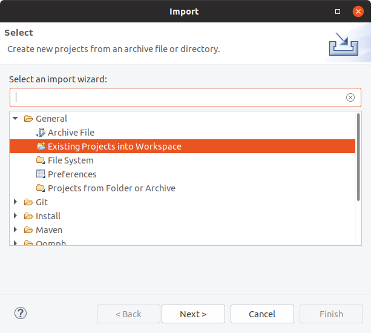
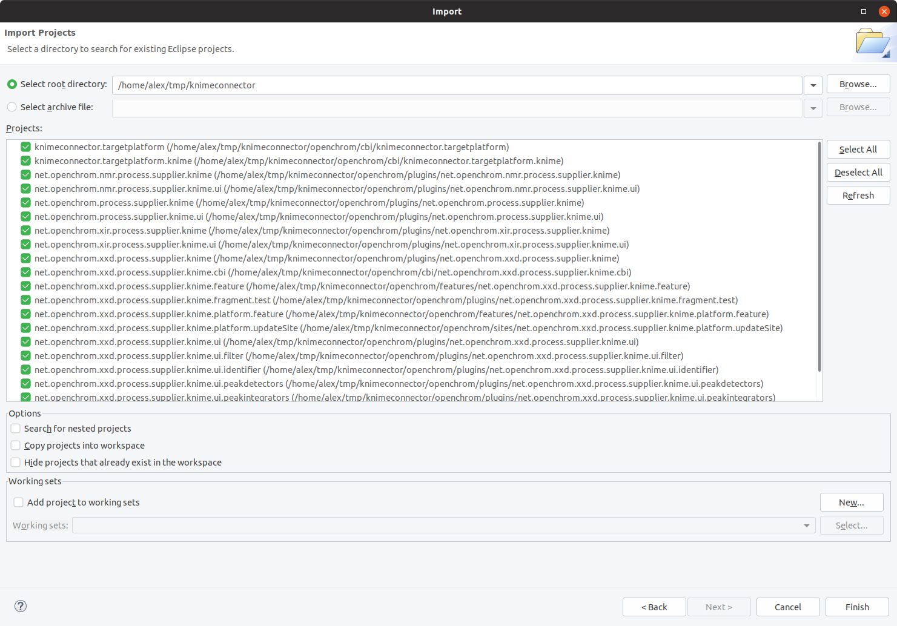
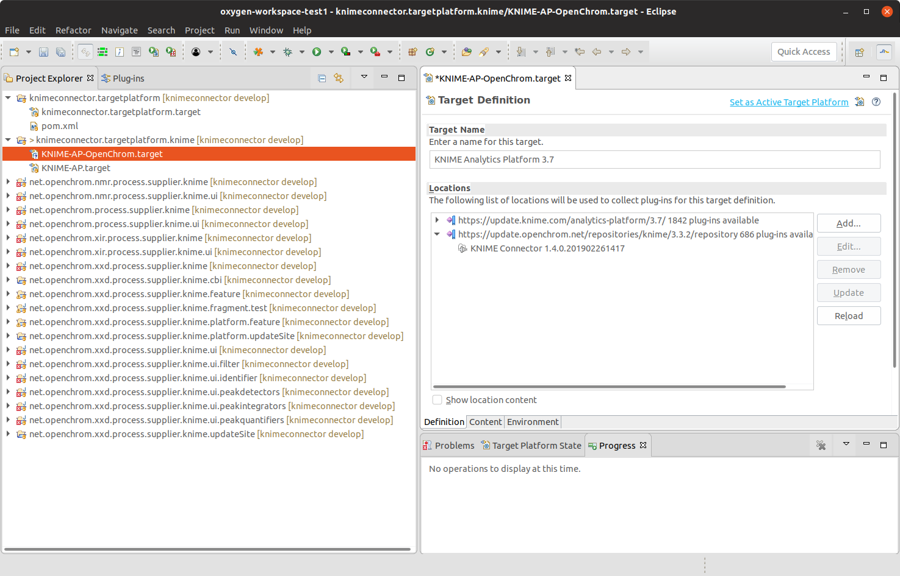
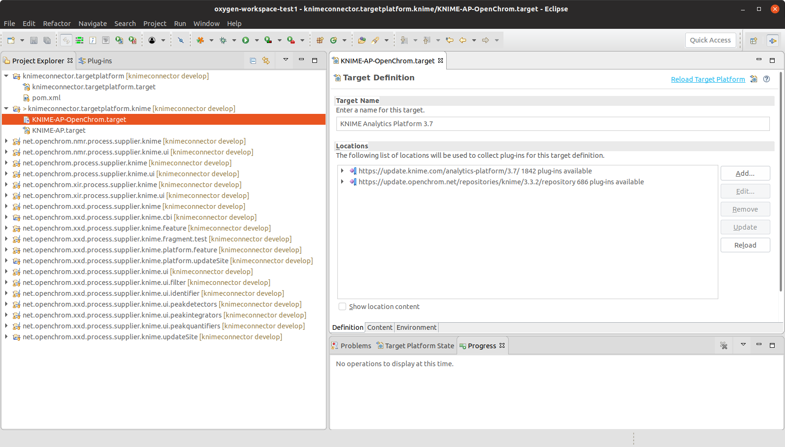
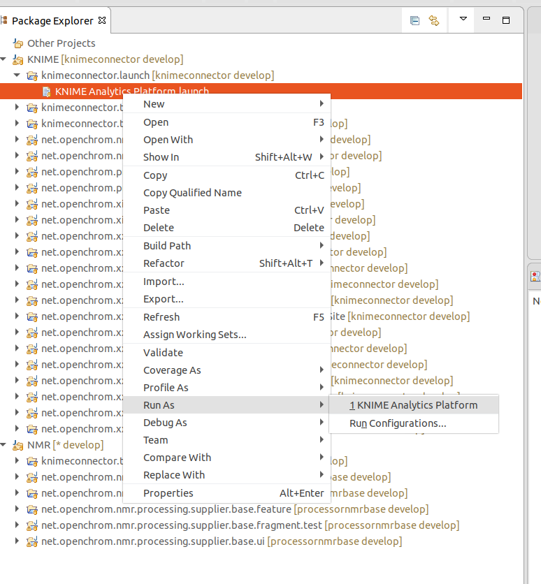
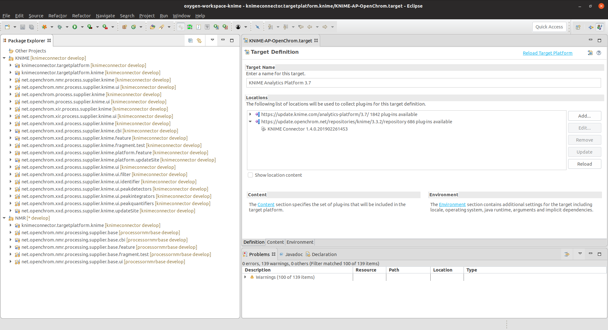

# OpenChrom - KNIME Connector

The tools provided in this repository will help you to create KNIME nodes from OpenChrom Plug-ins. 

Please make sure you are familiar with with a [basic KNIME development setup](https://github.com/knime/knime-sdk-setup).

## Setting up an OpenChrom - KNIME Connector Development Environment

+ Clone this project: `git clone git@github.com:OpenChrom/knimeconnector.git`

+ Check-out the `develop` branch:  `git checkout develop`

+ Start Eclipse, preferably with a fresh workspace.

+ Start the import wizard and select "Existing Projects into Workspace"

Select all projects and press "Finish".

A minimum setup would include just the `knimeconnector.targetplatform.knime` project.

+ Open The `KNIME-AP-OpenChrom.target` and click on *Set as active Target Platoform*.

After the target platform has been resolved (this can take some time), there should be no errors left in the workspace and you are ready to go.

### Starting

To start KNIME, right-click on *KNIME Analytics Platform.launch* and select *Run As* or *Debug As*  *KNIME Analytics Platform*.

## Some More Details

The projects, that have been imported into the workspace, are examples of OpenChrom plug-ins, that can be used as KNIME nodes as well. Due to licensing issues, OpenChrom plug-ins cannot implement KNIME extension points per default. To populate an OpenChrom plug-in as a KNIME node, it is therefore necessary to create a wrapper plug-in, that will register some other OpenChrom plug-in's functionality on the KNIME node extension points.

## Working on NMR-OpenChrom-KNIME-Nodes

For example, plug-ins following the naming convention  *.nmr.process.supplier.knime.* are wrapper plug-ins for the OpenChrom low-level, NMR data processing plug-ins (*.openchrom.nmr.processing.*).

To work on those plug-ins as well as their corresponding KNIME-node-wrappers, you need to import additionally the OpenChrom plug-ins, that are wrapped.
To do so, check out all existing projects from [OpenChrom NMR processing](https://github.com/OpenChrom/processornmrbase/tree/develop) and import them into your workspace.

`git clone git@github.com:OpenChrom/processornmrbase.git`

`git checkout develop`

